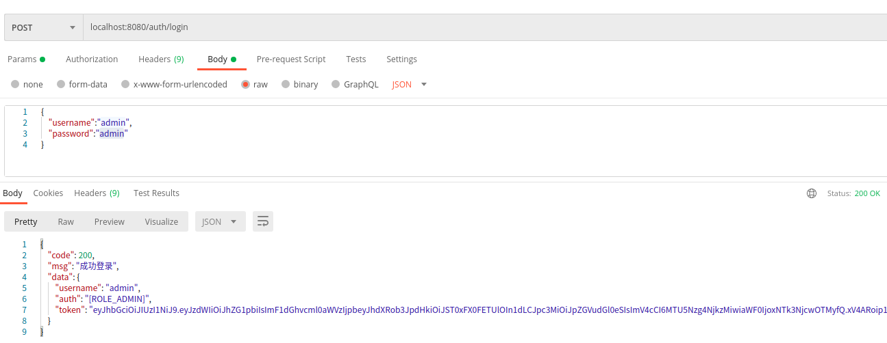
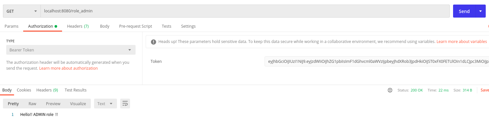

# Spring WebFlux (7): Springboot Security+jwt登录鉴权

在[Spring WebFlux (3): mysql+Springboot Security实现登录鉴权](https://blog.csdn.net/tonydz0523/article/details/107954589)的基础上实现

token登录的逻辑刚上手确实很复杂，挺难啃的，而且实现方法也不唯一，看过很多博客实现的方法基本都不一样，简单说一下我的方法：

+ 首先设置一个WebFilter，主要两个功能：
  1. 登录和注册时是没有token的，这两个功能的路由放行
  2. 其他请求检查token，是否有token，token是否合法，讲处理的token放入上下文中

+ 然后就是实现`ServerSecurityContextRepository`类
+ 实现`ReactiveAuthenticationManager`中的`authenticate` 方法 解析token，将解析的权限信息写入`Authentication`对象
+ 通过`ServerSecurityContextRepository`类中的load方法获取到上下文中的token，将token装到`Authentication`对象中，再通过`ReactiveAuthenticationManager`中的`authenticate` 方法获取到有权限信息的`Authentication`对象传入Security上下文中
+ 通过以上几个步骤实现登录和鉴权

## 项目依赖

webflux + mysql + r2dbc + jwt

openapi还需要配置一下添加token的功能，使用需要设置header

```java
dependencies {
    implementation 'org.springframework.boot:spring-boot-starter-data-r2dbc'
    implementation 'org.springframework.boot:spring-boot-starter-security'
    implementation 'org.springframework.boot:spring-boot-starter-webflux'
    implementation 'io.jsonwebtoken:jjwt:0.9.1'
    implementation 'org.springdoc:springdoc-openapi-webflux-ui:1.4.1'
    compileOnly 'org.projectlombok:lombok'
    runtimeOnly 'dev.miku:r2dbc-mysql'
    runtimeOnly 'mysql:mysql-connector-java'
    annotationProcessor 'org.projectlombok:lombok'
    testImplementation('org.springframework.boot:spring-boot-starter-test') {
        exclude group: 'org.junit.vintage', module: 'junit-vintage-engine'
    }
    testImplementation 'io.projectreactor:reactor-test'
    testImplementation 'org.springframework.security:spring-security-test'
}
```

## 1. 添加登录相关功能

添加两个接口：

+ `/auth/login`: 实现登录功能，输入username和password返回token权限等信息
+ `/auth/signup`: 实现注册功能

```java
/**
 * @author: ffzs
 * @Date: 2020/8/16 下午8:52
 */

@RestController
@RequiredArgsConstructor
@RequestMapping("auth")
@Slf4j
public class LoginController {

    private final MyUserDetailsRepository myUserRepository;
    private final MyUserService myUserService;
    private final JwtSigner jwtSigner;
    private final PasswordEncoder password = PasswordEncoderFactories.createDelegatingPasswordEncoder();

    @PostMapping("login")
    public Mono<HttpResult> login (@RequestBody Map<String, String> user) {

        return Mono.just(user.get("username"))
                .flatMap(myUserRepository::findByUsername)
                .filter(it -> password.matches(user.get("password"), it.getPassword()))
                .map(it -> new HttpResult(HttpStatus.OK.value(), "成功登录", new LoginResponse(it.getUsername(), it.getAuthorities().toString(), jwtSigner.generateToken(it))))
                .onErrorResume(e -> Mono.empty())
                .switchIfEmpty(Mono.just(new HttpResult(HttpStatus.UNAUTHORIZED.value(), "登录失败", null)));
    }


    @PostMapping("signup")
    public Mono<HttpResult> signUp (@RequestBody MyUser user) {

        return Mono.just(user)
                .map(myUserService::save)
                .map(it -> new HttpResult(HttpStatus.OK.value(), "注册成功", null))
                .onErrorResume(e -> Mono.just(new HttpResult(HttpStatus.UNAUTHORIZED.value(), "注册失败", e)));
    }
}
```

+ 因为登录在controller内部完成，并且需要根据相关信息生成jwt token，需要编写一个用来生成token以及拆解token的类

## 2. 编写jwt功能服务类

该类有几个功能：

+ 根据UserDetails中账号名，权限等信息生成token
+ 能够将token还原成原来传入的信息用于获取权限信息
+ 提供一些jwt相关参数
+ 关联配置文件中配置token失效时间

完整代码如下：

```java
/**
 * @author: ffzs
 * @Date: 2020/8/16 下午8:06
 */

@Service
@RequiredArgsConstructor
@Slf4j
public class JwtSigner {

    private final MyUserDetailsRepository myUserRepository;

    private final String key = "justAJwtSingleKey";
    private final String authorities = "authorities";
    private final String issuer = "identity";
    private final String TOKEN_PREFIX = "Bearer ";

    @Value("${jwt.expiration.duration}")
    private int duration ;


    public String getAuthoritiesTag () {
        return authorities;
    }

    public String getIssuerTag () {
        return issuer;
    }

    public String getTokenPrefix () {
        return TOKEN_PREFIX;
    }

    public String generateToken (String username) {

        return generateToken(Objects.requireNonNull(myUserRepository.findByUsername(username).block()));
    }

    public String generateToken (MyUserDetails user) {

        return Jwts.builder()
                .setSubject(user.getUsername())
                .claim(authorities, user.getAuthorities())
                .signWith(SignatureAlgorithm.HS256, key)
                .setIssuer(issuer)
                .setExpiration(Date.from(Instant.now().plus(Duration.ofMinutes(duration))))
                .setIssuedAt(new Date(System.currentTimeMillis()))
                .compact();
    }

    public Claims parseToken (String token) {
        log.info("token : {}", token);
        return Jwts
                .parser()
                .setSigningKey(key)
                .parseClaimsJws(token)
                .getBody();
    }
}
```

+ 实现过滤信息的Filter

## 3. 过滤token的Filter实现

前面也提到该Filter有两个功能：

+ 过滤掉处登录注册之外所有没有token的访问
+ 过滤掉token不合法
+ 更具不同类型问题返回对应的报错信息

```java
/**
 * @author: ffzs
 * @Date: 2020/8/17 下午12:53
 */

@Component
@Slf4j
@AllArgsConstructor
public class JwtWebFilter implements WebFilter {

    private final JwtSigner jwtSigner;

    protected Mono<Void> writeErrorMessage(ServerHttpResponse response, HttpStatus status, String msg) throws JsonProcessingException, UnsupportedEncodingException {
        response.getHeaders().setContentType(MediaType.APPLICATION_JSON);
        ObjectMapper mapper=new ObjectMapper();
        String body = mapper.writeValueAsString(new HttpResult(status.value(), msg, null));
        DataBuffer dataBuffer = response.bufferFactory().wrap(body.getBytes(StandardCharsets.UTF_8));
        return response.writeWith(Mono.just(dataBuffer));
    }

    @SneakyThrows
    @Override
    public Mono<Void> filter(ServerWebExchange exchange, WebFilterChain chain) {
        ServerHttpRequest request = exchange.getRequest();
        ServerHttpResponse response = exchange.getResponse();

        String path = request.getPath().value();
        if (path.contains("/auth/login") || path.contains("/auth/signout")) return chain.filter(exchange);

        String auth = request.getHeaders().getFirst(HttpHeaders.AUTHORIZATION);
        if (auth == null) {
            return this.writeErrorMessage(response, HttpStatus.NOT_ACCEPTABLE, "没有携带token");
        }
        else if (!auth.startsWith(jwtSigner.getTokenPrefix())) {
            return this.writeErrorMessage(response, HttpStatus.NOT_ACCEPTABLE, "token 没有以" + jwtSigner.getTokenPrefix() + "开始");
        }

        String token = auth.replace(jwtSigner.getTokenPrefix(),"");
        try {
            exchange.getAttributes().put("token", token);
        } catch (Exception e) {
            return this.writeErrorMessage(response, HttpStatus.INTERNAL_SERVER_ERROR, e.getMessage());
        }

        return chain.filter(exchange);
    }
}
```

之后就是通过`ServerSecurityContextRepository`类将token内容写入SecurityContext

## 4. ServerSecurityContextRepository功能实现

+ 获取上下文中的token
+ 将token传入`AuthenticationManager`的`authenticate`方法
+ 将`authenticate`方法解析之后完成的`Authentication`写入`SecurityContext`

```java
/**
 * @author: ffzs
 * @Date: 2020/8/16 下午8:05
 */

@Component
@AllArgsConstructor
@Slf4j
public class SecurityContextRepository implements ServerSecurityContextRepository {

    private final JwtAuthenticationManager jwtAuthenticationManager;

    @Override
    public Mono<Void> save(ServerWebExchange exchange, SecurityContext context) {
        return Mono.empty();
    }

    @SneakyThrows
    @Override
    public Mono<SecurityContext> load(ServerWebExchange exchange) {
        log.info("访问 ServerSecurityContextRepository  。。。。。。。。。。。");

        String token = exchange.getAttribute("token");
        return jwtAuthenticationManager.authenticate(
                new UsernamePasswordAuthenticationToken(token, token)
            )
            .map(SecurityContextImpl::new);
    }
}
```

## 5. authenticate方法实现

+ 上一步传入的token进行解析
+ 解析的信息写入`Authentication`类

```java
/**
 * @author: ffzs
 * @Date: 2020/8/16 下午6:18
 */

@Component
@AllArgsConstructor
@Slf4j
public class JwtAuthenticationManager implements ReactiveAuthenticationManager {

    private final JwtSigner jwtSigner;

    @Override
    public Mono<Authentication> authenticate(Authentication authentication) {
        log.info("访问 ReactiveAuthenticationManager  。。。。。。。。。。。");
        return Mono.just(authentication)
                .map(auth -> jwtSigner.parseToken(auth.getCredentials().toString()))
                .log()
                .onErrorResume(e -> {
                    log.error("验证token时发生错误，错误类型为： {}，错误信息为： {}", e.getClass(), e.getMessage());
                    return Mono.empty();
                })
                .map(claims -> new UsernamePasswordAuthenticationToken(
                        claims.getSubject(),
                        null,
                        Stream.of(claims.get(jwtSigner.getAuthoritiesTag()))
                                .peek(info -> log.info("auth权限信息 {}", info))
                                .map(it -> (List<Map<String, String>>)it)
                                .flatMap(it -> it.stream()
                                        .map(i -> i.get("authority"))
                                        .map(SimpleGrantedAuthority::new))
                                .collect(Collectors.toList())
                ));
    }
}
```

## 6. Security配置

+ 对`/auth/login`和`/auth/signup`的放行
+ 对filter的设置
+ `jwtWebFilter`执行一定要在`SecurityContextRepository`之前，不然的话上下文中没有token

```java
/**
 * @author: ffzs
 * @Date: 2020/8/11 下午4:22
 */

@EnableWebFluxSecurity
@EnableReactiveMethodSecurity
@AllArgsConstructor
public class SecurityConfig {

    private final SecurityContextRepository securityRepository;

    @Bean
    public SecurityWebFilterChain securityWebFilterChain(
                ServerHttpSecurity http,
                JwtWebFilter jwtWebFilter
        ) {

        return http
                .authorizeExchange()
                .pathMatchers("/auth/login", "/auth/signup").permitAll()
                .pathMatchers("/v3/api-docs/**", "/swagger-resources/configuration/ui",
                        "/swagger-resources","/swagger-resources/configuration/security",
                        "/swagger-ui.html","/css/**", "/js/**","/images/**", "/webjars/**", "**/favicon.ico", "/index").permitAll()
                .anyExchange().authenticated()
                .and()
                .addFilterAfter(jwtWebFilter, SecurityWebFiltersOrder.FIRST)  // 这里注意执行位置一定要在securityContextRepository
                .securityContextRepository(securityRepository)
                .formLogin().disable()
                .httpBasic().disable()
                .csrf().disable()
                .logout().disable()
                .build();
    }
}
```

## 7.  application.yml

+ 设置mysql链接
+ 设置token的持续时间（分钟）

```java
spring:
  r2dbc:
    username: root
    password: 123zxc
    url: r2dbcs:mysql://localhost:3306/mydb?useUnicode=true&zeroDateTimeBehavior=convertToNull&autoReconnect=true&characterEncoding=utf-8

jwt:
  expiration:
    duration: 3600  
```


## 8. 测试

+ 登录



+ 访问




## 代码

github

