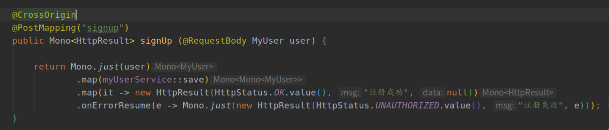
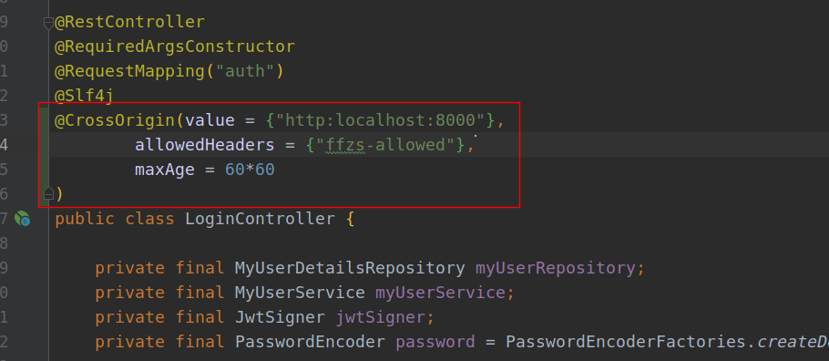
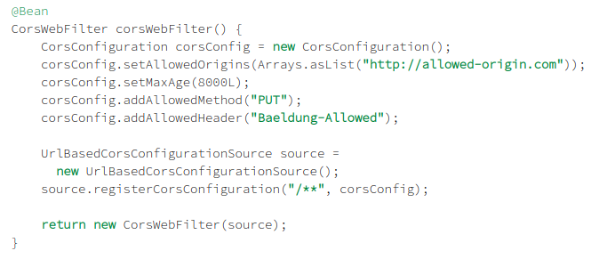

# Spring WebFlux (7):  处理跨域请求cors设置

前后端分离访问api会出现跨域资源共享（CORS）问题，webflux框架处理cors主要四种方法：

+ 处理方法设置注释@CrossOrigin
+ controller上设置@CrossOrigin
+ 设置cors的configuration文件
+ 设置cors的Webfilter

前两个为局部设置，后两个为全局设置

## 1. 方法标注@CrossOrigin

在需要开放资源的方法上面注释CrossOrigin即可：

@CrossOrigin注释的设置具有如下的默认配置：

+ 允许所有来源
+ 允许所有请求头
+ 允许所有请求方法
+ maxAge为1800秒

## 2.  在controller上设置@CrossOrigin

改设置决定该controller类中的所有方法，如果某个方法并不适用，使用上面的方法单独设置即可：

## 3. 全局配置上设置CORS

通过覆盖WebFluxConfigurer实现的addCorsMappings（）方法来定义全局CORS配置：

对于局部设置和全局设置，局部优先于全局

## 4. WebFilter

Spring提供了内置的CorsWebFilter， 可以直接@Bean注入即可，不过不能与更细粒度的*@CrossOrigin* 配置结合使用 。

